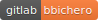
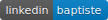

<h3>Baptiste Bicheron</h3>

   
   
   
   
   

---
 

System maintenance, Storage avaibilty, Network redundancy, Installation automatisation and
documentation writing are ability that I'm testting and learning everyday for my personal purpose.
I'm still studing at 42 school in Paris where I learned: helping others, coding, work in group
and for me the most important thing: learn how to learn.

 

Latest projects
---
- [Gitarchive](https://gitlab.com/gitarchive.com), a microservice architecture web pages crawler with git history.
- [Roger skyline 2](https://gitlab.com/roger-skyline/rs-2), a micro entreprise-like infrastructure in 10 VMs, with mail
server, ldap, gateway, loadbalancer,  monitoring automatisation, ...
- [Documentation](https://gitlab.com/bbichero/documentation), a list of documentations files from software, and other stuff I install and use.

Current projects
---
- [Ukeep](https://gitlab.com/ukeep), Make backup easier, a multiplatform application to backup data

 

## Experience

#### Internet exchange intern [Equinix](https://www.equinix.fr/locations/europe-colocation/france-colocation/paris-data-centers/)
##### January 2016 (1 year) Pantin Paris
Develop and create tools for the Internet Exchange peering point

---

#### IT intern [Station F](https://stationf.co/)
##### September 2017 (6 months) Paris 13
Welcome the newly-arrived, create badge, maintain Wifi, camera and network infrastructure.

---

#### IT officer [Station F](https://stationf.co/)
##### March 2018 (6 months) Paris 13
Develop and maintain Station F network architecture.

---

 

## Education

#### Computer Science [42](https://42.fr/)
##### (2014 - 2019) Paris 17
Free and non-profit school to learn computer science, "peer-to-perr" coding with passionate people.

#### Scientific Bachelor
##### (2011 - 2013) Arles 13
A General Scientific bachelor with Ingenior Sciences option in the south of France.

 

## Stack

### Programing language
- C (when enter at 42)
- PHP (3 years)
- Python (1 year)
- Bash (when enter at 42)
- NodeJS (2 years)
- Rust (Starting learn)

### System
- Debian (4 years)
- Virtualisation => KVM / QEMU (2 years)
- Database => Mysql / Mariadb / PostgreSQL (2 years)
- VM and Filesystem managment => Libvirt / Libguestfs (2 years)
- Container managment => Docker (1 years)
- Automatisation => Ansible / Terraform (1 year)
- Proxmox / Ovirt (6 months)
- Network => VLAN, VPN, Firewall, DNS, DHCP (3 years)
- VMware ESXi (1 yers)

### Hardware
- DELL / IBM servers (2 years)
- Cisco switch / router (1 years)
- Raspberry Pi 3

### Languages
- French
- English

## Hobies
- Nature
- Grow plants
- Computer science and server managment
