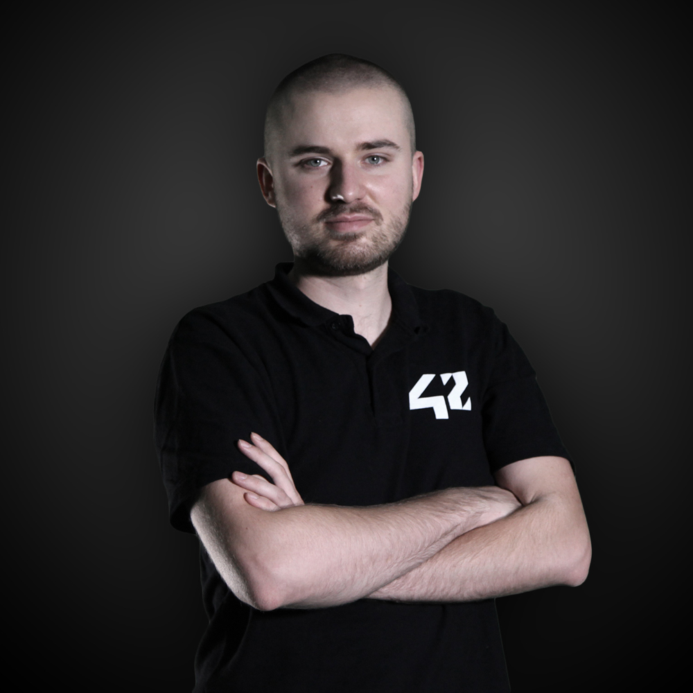

<h3 align=center>Baptiste Bicheron</h3>

 

   
   
   
   
   

 

System maintenance, Storage avaibilty, Network redundancy, Installation automatisation and
documentation writing are ability that I'm testing and learning everyday for my personal purpose.
I studied at 42 school in Paris, where I learned to helping others, coding, work in a group   
and the most important thing: Learning How to Learn.
 

Latest projects
---
- [Gitarchive](https://gitlab.com/gitarchive.com), a microservice architecture web pages crawler with git history.
- [Roger skyline 2](https://gitlab.com/roger-skyline/rs-2), a micro entreprise-like infrastructure in 10 VMs, with mail
server, ldap, gateway, loadbalancer,  monitoring automatisation, ...
- [Documentation](https://gitlab.com/bbichero/documentation), a list of documentations files from software, and other stuff I install and use.
- [Ukeep](https://gitlab.com/ukeep), Make backup easier, a multiplatform application to backup data
- [Redfish exporter](https://github.com/42School/redfish-exporter), Prometheus exporter for Redfish IDRAC API (DELL servers)

Current projects (deprecated)
---
- [Cleandoc](https://gitlab.com/bbichero/cleandoc.org), Make better documentation with an automated testing system. 

 

## Experience

#### Internet exchange intern [Equinix](https://www.equinix.fr/locations/europe-colocation/france-colocation/paris-data-centers/)
##### January 2016 (1 year) Pantin Paris
Develop and create tools for the Internet Exchange peering point

---

#### IT intern [Station F](https://stationf.co/)
##### September 2017 (6 months) Paris 13
Welcome the newly-arrived, create badges, maintain Wifi, camera and network infrastructure.

---

#### IT officer [Station F](https://stationf.co/)
##### March 2018 (6 months) Paris 13
Develop and maintain Station F network architecture.   

---

#### Stage SI [42](http://www.42.fr/)
##### Jun 2019 (6 months) Paris 17   
Maintain and enhance / services IT infrastructure in a team

---

#### Responsable SI [42](http://www.42.fr/)
##### Dec 2019 - jun 2022 (2.5 years) Paris 17
Maintain enhance / services IT infrastructure and manage a team (4 people)

 

## Education

#### Computer Science [42](https://42.fr/)
##### (2014 - 2019) Paris 17
Free and non-profit school to learn computer science, "peer-to-perr" coding with passionate people.

#### Scientific Bachelor [Lycée Louis Pasquet](http://www.lyc-pasquet.ac-aix-marseille.fr/spip/)
##### (2011 - 2013) Arles 13
A General Scientific bachelor with Ingenior Sciences option in the south of France.

 

## Stack
Notation system : from 1 to 5 (noob to expert)

### Programing language
- C (when enter at 42) -> (2/5)
- PHP (1-2 years) -> (2/5)
- Python (3 year) -> (3/5)
- Bash (when enter at 42) -> (2/5)
- NodeJS (2 years) -> (2/5)
- Starting Golang -> (1/5)

### System
- Linux based system (Debian / Fedora) (6 years)
- Monitoring (install / maintain / backup) (3/5)
   - Prometheus
   - SNMP based (ZABBIX / Observium)
- Virtualization (KVM / QEMU)
- Database (install / maintain / backup) (3/5)
   - MySQL
   - MariaDB
   - PostgreSQL
- VM and Filesystem managment (Libvirt / Libguestfs) -> (3/5)
- Container managment (install / maintain / backup)
   - Docker -> (4/5)
   - Kubernetes -> (2/5)
- Automatisation (install / use)
   - Ansible -> (4/5)
   - Terraform -> (2/5)
- Virtualization manager (install / maintain / backup)
   - Vmware stack -> (3/5)
   - Proxmox / Ovirt -> (3/5)
- Network
   - Linux services (install / maintain) (3/5)
      - DNS
      - DHCP
      - Standart networking CLI tools
   - IOS Cisco (use)
      - VLAN

### Hardware
- DELL / IBM servers
- Netgate Pfsense
- Cisco
   - switch (2960s)
   - router (9300)
- Raspberry Pi

### Languages
- French
- English

## Hobies
- Nature
- Grow plants
- Computer science and server managment
